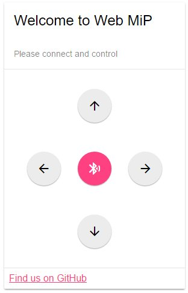

# webble-mip

> Control your MiP robot directly from your web browser! 

Use with the [MiP robot](http://wowwee.com/mip).

## Online Demo

Currently works only with Chrome 53 ([Beta Channel]()) or newer. In Chrome Stable, you will have to enable Web Bluetooth in chrome://flags first.

➡ [Open Online Demo](https://urish.github.io/webble-mip)

